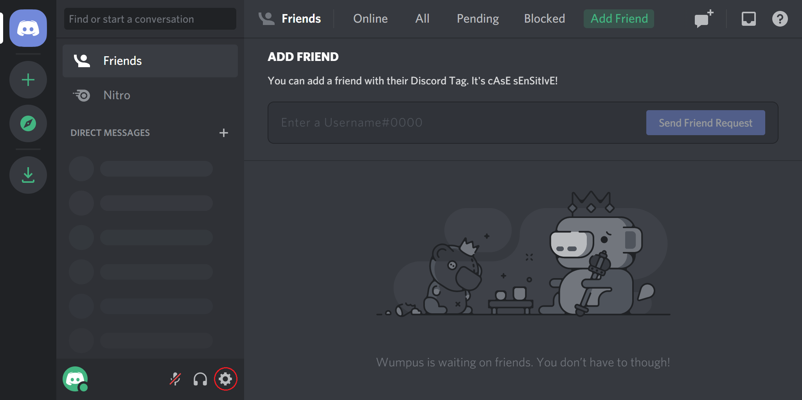
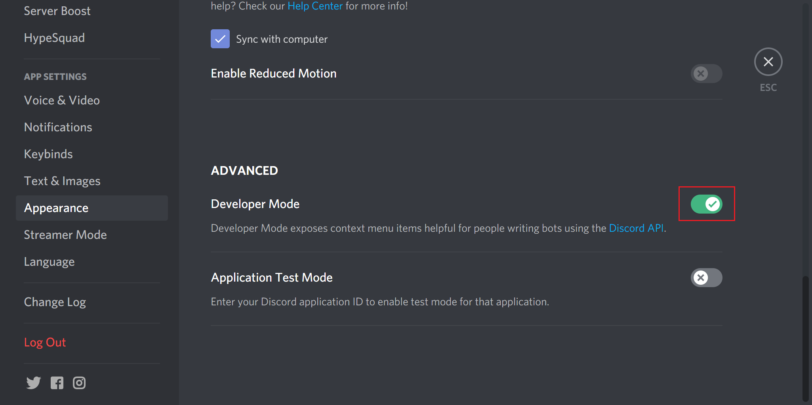
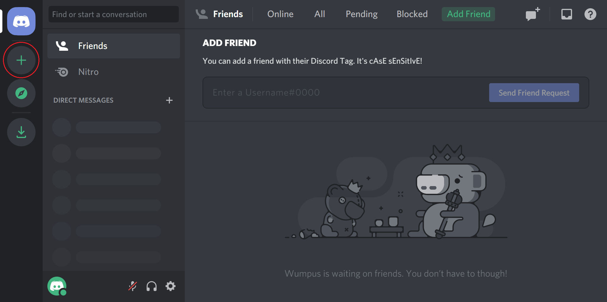
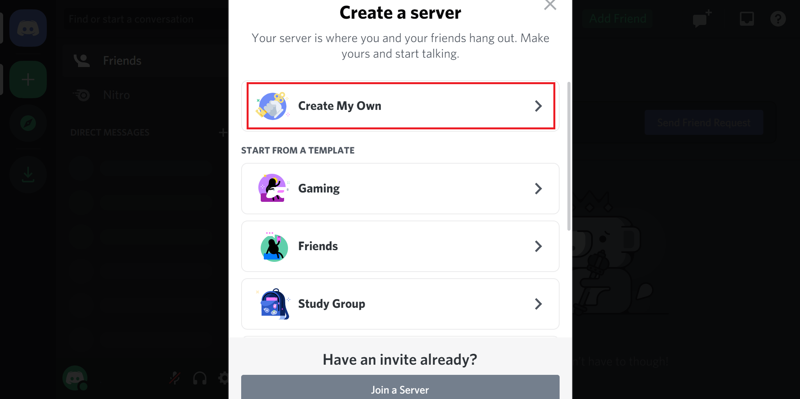
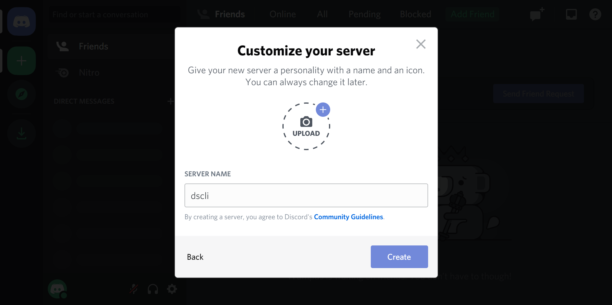
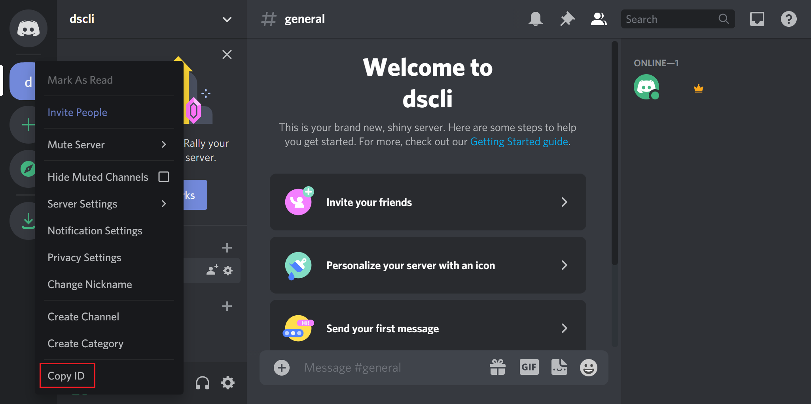
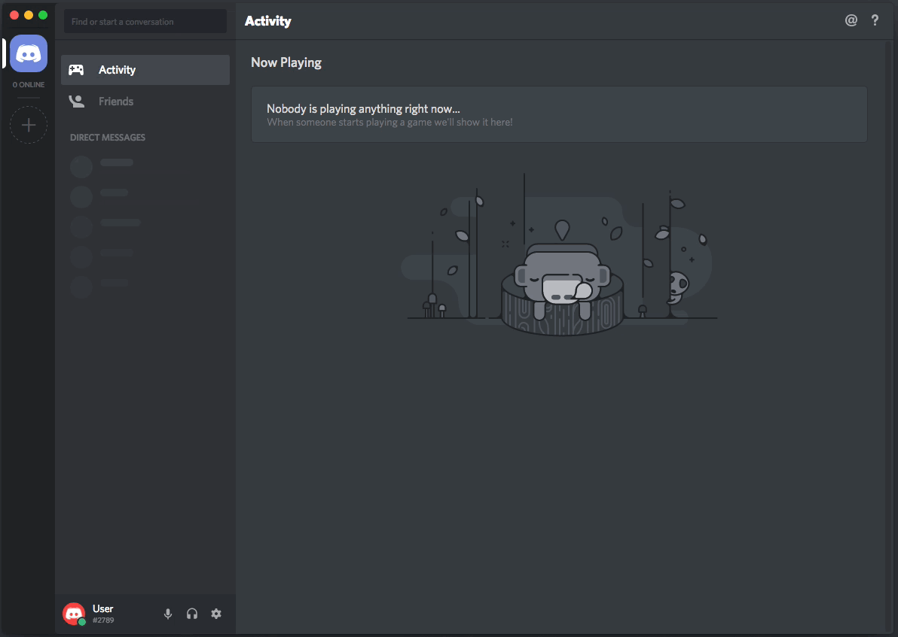

# Dscli Quickstart

### Step 1: Enable developer mode

Go to the Discord client or https://discord.com/app.

Click on the gear icon.



Go to "Appearance" and toggle "Developer Mode" to on.



### Step 2: Create a Discord server

Go to the Discord client or https://discord.com/app.

Click on the plus icon.



Click on "Create My Own".



Enter anything as the server name and click on "Create".



Right-click on the server icon and click on "Copy ID".



**Save the server ID.**

### Step 3: Get your own user token

> Automating user accounts is technically against TOS, use at your own risk.

Press **Ctrl+Shift+I** (⌘⌥I on Mac) on Discord to show developer tools.

Navigate to the **Application** tab.

Select **Local Storage** > **https://discordapp.com** on the left.

Press **Ctrl+R** (⌘R) to reload.

Find **token** at the bottom and copy the value.

> You may also get your own bot token instead.



### Step 4: Configure dscli

**As part of the setup, dscli will delete any remaining channels in the server.**

> If you are using a bot token, add the "Bot " prefix to the discord token.

```
dscli config -t=<YOUR-DISCORD-TOKEN> -i=<YOUR-SERVER-ID> -d
```

For configuring dscli interactively:

```
dscli config
```
