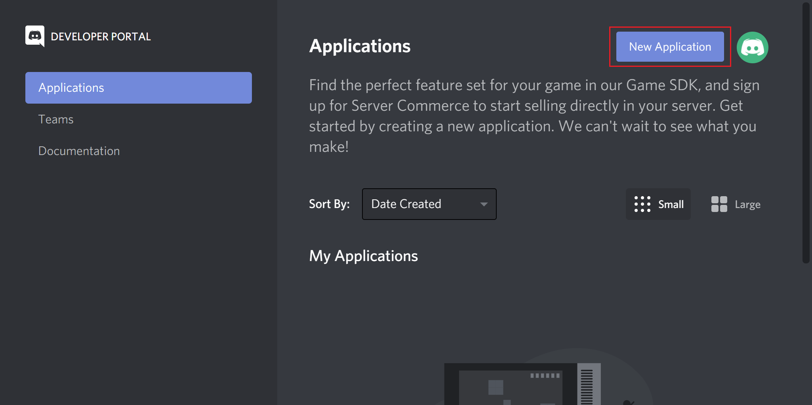
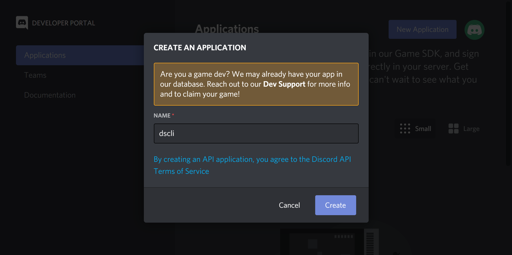
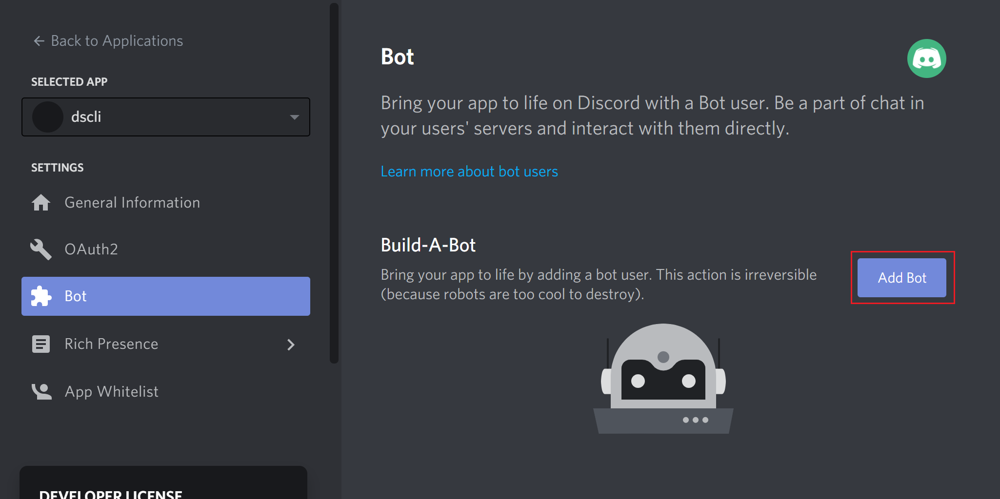
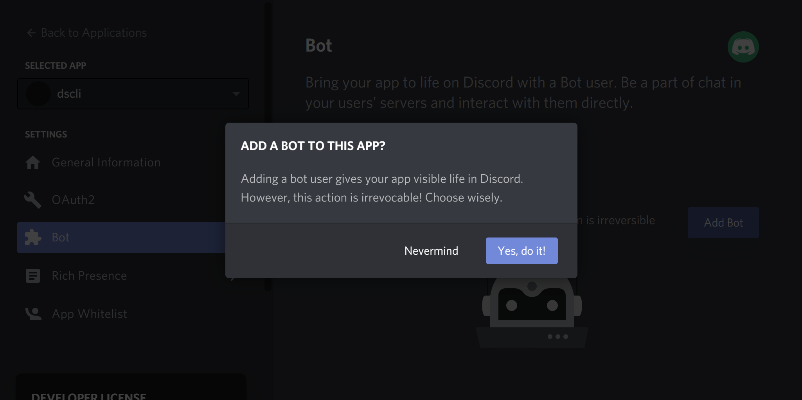
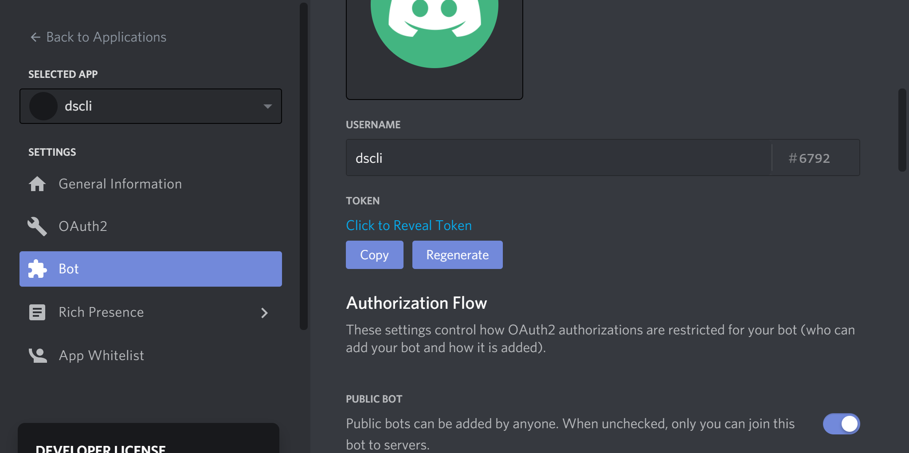
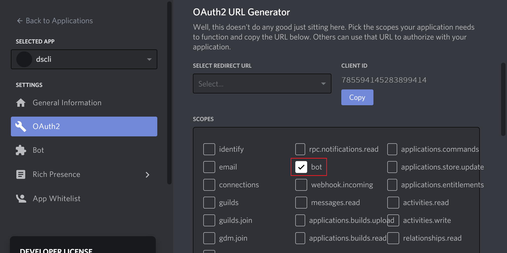
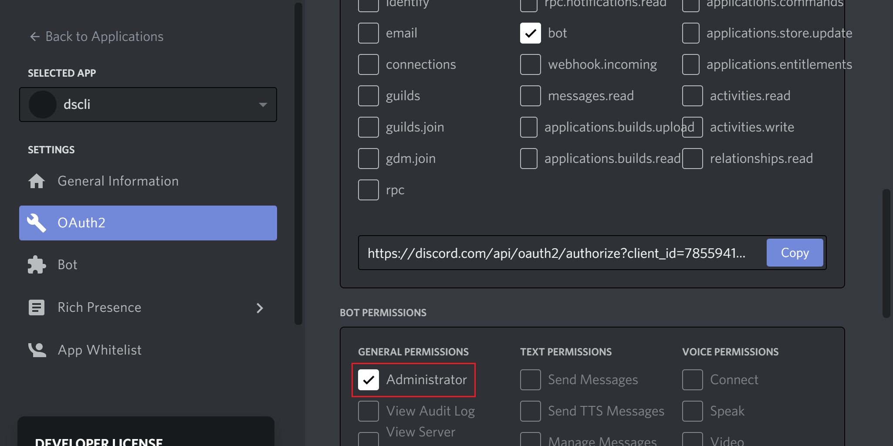
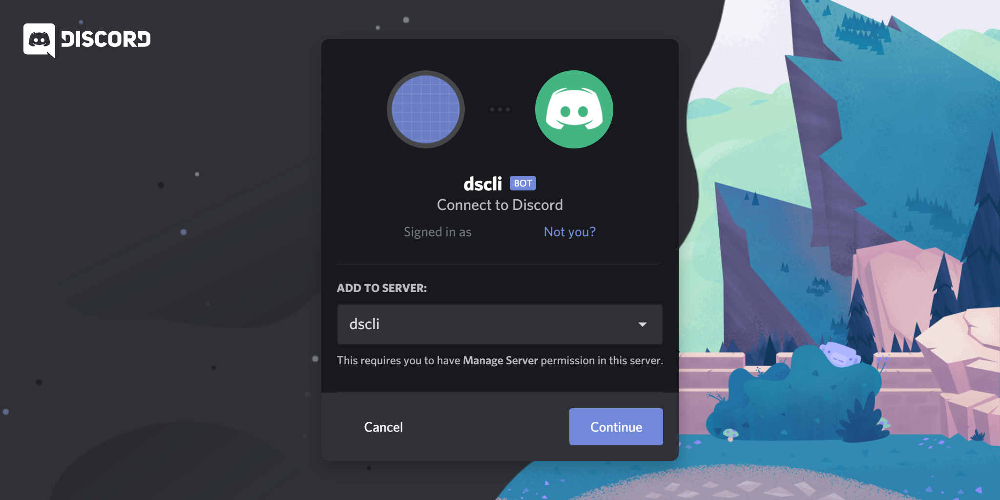

# Dscli Quickstart

### Step 1: Enable developer mode

Go to the Discord client or https://discord.com/app.

Click on the gear icon.


Go to "Appearance" and toggle "Developer Mode" to on.


### Step 2: Create a Discord server

Go to the Discord client or https://discord.com/app.

Click on the plus icon.


Click on "Create My Own".


Enter anything as the server name and click on "Create".


Right-click on the server icon and click on "Copy ID".


**Save the server ID.**

### Step 3: Create a Discord bot

Go to https://discord.com/developers/applications.

Click on "New Application".



Enter anything as the Discord bot name and click on "Create".



Go to "Bot" and click on "Add Bot".



Click on "Yes, do it!".



Click on "Copy".



**Save the Discord bot token.**

### Step 4: Invite the Discord bot to the server

Go to https://discord.com/developers/applications.

Select the application, go to "OAuth2" and click on "bot" under "SCOPES".



Under "SCOPES" and in "BOT PERMISSIONS", click on "Administrator".

Click on "Copy".



Go to the link copied and invite the bot.



### Step 5: Configure dscli

**As part of the setup, dscli will delete any remaining channels in the server.**

```
dscli -t=<YOUR-DISCORD-BOT-TOKEN> -i=<YOUR-SERVER-ID> -d
```
